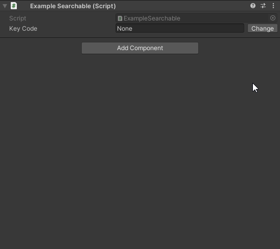
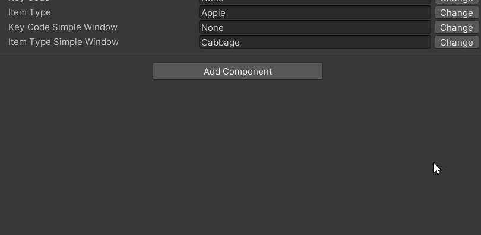

# SearchableAttribute

Этот пакет позволяет Вам использовать атрибут `Searchable`, который реализует функционал всплывающего окна вместе с
строкой поиска, которая позволяет быстро найти нужный элемент.

## Добавление в проект

Чтобы добавить данный пакет в проект, нужно выполнить следующие шаги:

1) Откройте PackageManager;
2) Выберите "Add package from get URL";
3) Вставьте ссылки на пакеты, которые являются зависимостями данного пакета:
    + `https://github.com/Paulsams/MiscUtilities.git`
3) Вставьте ссылку на данный пакет: `https://github.com/Paulsams/SearchableAttribute.git`

## Зависимости

- Использует:
    + MicsUtilities: https://github.com/Paulsams/MiscUtilities.git

## Возможности

1) Работает с перечислениями безо всякой дополнительной настройки.

```cs
[SerializeField, Searchable] private KeyCode _keyCode;
```



2) Позволяет писать свои кастомные преобразования в список строк из которых можно выбирать и присваивать значение полю
   через `SerializedProperty`.

Чтобы его создать, нужно просто реализовать интерфейс `ISearchableConverter` на подобии примера ниже и передать в
конструктор `Searchable` тип конверетера (легче всего через `typeof`).

**Заметки**: \
Создавать конвертеры Вы можете в любом месте, но прошу заметить, что нужно создавать его в Runtime сборке, поэтому в
примере ниже у меня так много `#if UNITY_EDITOR`, чтобы можно было написать `typeof` над типом. Это сделано специально,
так как решения через кодогенерацию мне не понравились, а решение через какой-нибудь `Mono.Cecil` не хотел
использовать.

```cs
[SerializeField, Searchable(typeof(ItemTypesConverter))] private string _itemType;
```

```cs
#if UNITY_EDITOR
using System.IO;
using System.Linq;
using UnityEditor;
using Paulsams.Searchable.Converters;
using UnityEngine;
#endif

namespace Paulsams.Searchable.Example
{
    public class ItemTypesConverter
#if UNITY_EDITOR
        : ISearchableConverter
    {
        // Такое усложнение свойственно JsonUtility
        [System.Serializable]
        private class Wrapper { /*...*/ }
        
        private readonly ISearchableConverter.Element[] _items;

        public ItemTypesConverter()
        {
            string pathToJson = $"{Application.dataPath}/Samples/SearchableAttribute/2.0.1/" +
                                "Example Enum and One Custom Converter/ItemTypes/ItemsTypes.json";

            if (File.Exists(pathToJson) == false)
            {
                Debug.LogError($"File with item types was not found on the path: {pathToJson}");
                return;
            }

            // Чтобы не добавлять новую зависимость в виде того же Newtonsoft.Json — я использую JsonUtility.
            // И я тщательно не рекомендую вообще его юзать.
            var json = File.ReadAllText(pathToJson);
            json = "{\"Items\":" + json + "}";
            var wrapper = JsonUtility.FromJson<Wrapper>(json);
            _items = wrapper.Items
                .Select((itemType) => new ISearchableConverter.Element($"{itemType.Category}/{itemType.Name}"))
                .ToArray();
        }

        public ISearchableConverter.Element[] Convert(SerializedProperty property) => _items;

        public int GetIndex(SerializedProperty property) =>
            System.Array.FindIndex(_items, (element) => element.Name == property.stringValue);

        public void SetIndex(SerializedProperty property, int index) =>
            property.stringValue = _items[index].Name;
    }
#else
{ }
#endif
}
```



3) Есть два способа отрисовать это окошко: через окошко написанное мной с нуля или через `AdvancedDropdown` от Unity.

По умолчанию стоит способ через `AdvancedDropdown`, но можно явно указать поведение с помощью параметра `windowType` в
конструкторе атрибута.

- `SearchableWindowType.Simple` - это моя реализация;
- `SearchableWindowType.Advanced` - это `AdvancedDropdown` от Unity.

## Конструкторы

```cs
SearchableAttribute(Type converterType = null, SearchableWindowType windowType = SearchableWindowType.Advanced)
```

## Пример

Чтобы скачать пример к данному пакету:

1) Выберите данный пакет в `PackageManager`;
2) Раскройте справа вкладку `Samples`;
3) И нажмите кнопку `Import` на единственном примере;
4) Внутри этого примера есть скрипт `ExampleSearchable` унаследованный от `MonoBehaviour`, в котором есть несколько
   примеров работы атрибута.