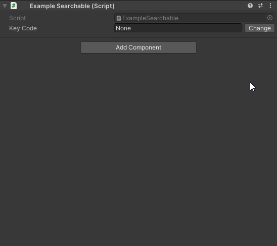
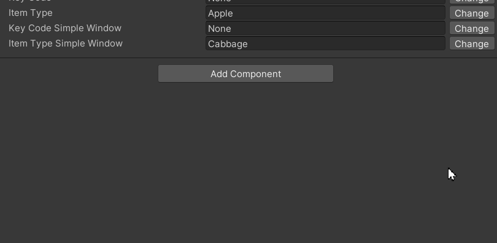

# SearchableAttribute

This package allows you to use the `Searchable` attribute, which implements a popup window with a search bar that enables
you to quickly find the desired item.

[Документация на русском](Documentation~/RU.md)

## Add to project

To add this package to the project, follow these steps:

1) Open PackageManager;
2) Select "Add package from get URL";
3) Insert links to packages that are dependencies of this package:
    + `https://github.com/Paulsams/MiscUtilities.git`
4) Insert this link `https://github.com/Paulsams/SearchableAttribute.git`

## Dependencies

- Is using:
    + MicsUtilities: https://github.com/Paulsams/MiscUtilities.git

## Opportunities

1) Works with enums without any additional configuration.

```cs
[SerializeField, Searchable] private KeyCode _keyCode;
```



2) Allows you to write your custom Converters into a list of strings from which you can select and assign a value
   to a field through `SerializedProperty`.

To create it, simply implement the `ISearchableConverter` interface as shown in the example below and pass the converter
type to the `Searchable` constructor (most easily done via `typeof`).

**Notes**:
You can create converters anywhere, but please note that you need to create it in the Runtime assembly, which is why I
have so many `#if UNITY_EDITOR` directives in the example below, to be able to write `typeof` over the type. This is
done intentionally, as I didn't like the code generation solutions, and I didn’t want to use a solution through
some `Mono.Cecil`.

```cs
[SerializeField, Searchable(typeof(ItemTypesConverter))] private string _itemType;
```

```cs
#if UNITY_EDITOR
using System.Linq;
using UnityEditor;
using Paulsams.MicsUtils;
using Paulsams.Searchable.Converters;
using UnityEngine;
#endif

namespace Paulsams.Searchable.Example
{
    public class ItemTypesConverter
#if UNITY_EDITOR
        : ISearchableConverter
    {
        private readonly ISearchableConverter.Element[] _items;

        public ItemTypesConverter()
        {
            string pathToJson = $"{Application.dataPath}/Samples/SearchableAttribute/2.0.0/Example Enum and One Custom Converter/ItemTypes/ItemsTypes.json";

            if (JsonSerializerUtility.TryDeserialize(out ItemType[] itemTypes, pathToJson))
            {
                _items = itemTypes.Select((itemType) => new ISearchableConverter.Element($"{itemType.Category}/{itemType.Name}")).ToArray();
            }
            else
            {
                Debug.LogError($"The file with item types was not found on the path: {pathToJson}");
            }
        }

        public ISearchableConverter.Element[] Convert(SerializedProperty property) => _items;

        public int GetIndex(SerializedProperty property) => System.Array.FindIndex(_items, (element) =>
            element.Name == property.stringValue);

        public void SetIndex(SerializedProperty property, int index) =>
            property.stringValue = _items[index].Name;
    }
#else
{ }
#endif
}
```



3) There are two ways to render this window: using my custom window or through Unity's `AdvancedDropdown`.

By default, the method using `AdvancedDropdown` is used, but you can explicitly specify the behavior using
the `windowType` parameter in the attribute constructor.

- `SearchableWindowType.Simple` - this is my implementation;
- `SearchableWindowType.Advanced` - this is Unity's `AdvancedDropdown`.

## Constructors

```cs
SearchableAttribute(Type converterType = null, SearchableWindowType windowType = SearchableWindowType.Advanced)
```

## Example

To download the example for this package:

1) Select this package in the `PackageManager`;
2) Expand the `Samples` tab on the right;
3) Click the `Import` button on the single example;
4) Inside this example, there is a script `ExampleSearchable` inherited from `MonoBehaviour`, which contains several
   examples of the attribute in use.
